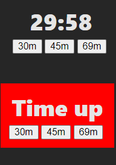

# imba-countdown

- ✔️ Simple countdown clock - just to set artificial deadline to my task at hand 😊.
- ✔️ 30min 45min and 60min
- run as separate windows

## info
- repo at https://github.com/me7/imba-countdown
- deploy at https://imba-countdown.surge.sh/
